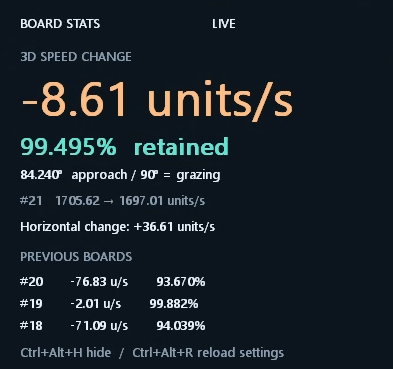
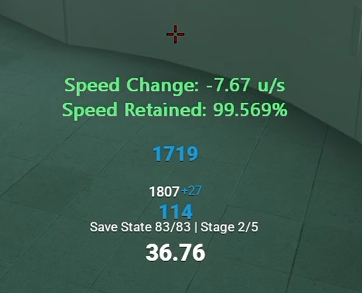

# Momentum BoardStats

Rampboarding stats for Momentum Mod (0.10.8)

## Preview

BoardStats comes in two easily switchable modes:

In-Game HUD                |  In-Game Stats
:-------------------------:|:-------------------------:
    |  

Modes can be easily switched via the following configuration:  
`Compact=0` and `Compact=1` show full HUD.  
`Compact=2` switches to centered stats text.  

See [Configuration](#configuration) for more info.  

## Map

- BoardStats.dll: Internal hooker (>.>) for `server.dll` + configurable in-game HUD/stats.
- Launcher.exe: One-click start/wait/stop coordinator.
- Controller.exe: Safety injector with version checks and command interface.
- boardstats_settings.exe: Config settings editor.
- MinHook: As a static library for hooking.
- CoreTests, LifecycleTests, RendererTests: Vibe-coded tests.

## Running

1. Start Momentum Mod
2. Extract [BoardStats.zip](https://github.com/x0reaxeax/Momentum-BoardStats/releases) and run `Launcher.exe`.  
3. Re-read this to double-check it was really that ez. Yes it was, mwah.  

- `Ctrl+Alt+Q` in-game to close BoardStats.  
- `Ctrl+Alt+H` in-game to hide HUD/stats.  

### Important Note 
Momentum Mod currently doesn't have a client-side anti-cheat, however, I'm not responsible for any bans / leaderboard deletions regardless.  
This program does **NOT** allow for cheating, but still tampers with game memory in order to read and capture ramp board stats/data.  
**USE AT YOUR OWN RISK**  

Less-important Note: The DLL and trampolines are not cleaned up after stopping, so a session can restart without unloading code still reachable by callbacks.    

## OBS Compatibility
Enable "Capture third-party overlays" in OBS Game Capture.  


## Configuration

Run `boardstats_settings.exe` or edit `boardstats.ini` manually.  

`Ctrl+Alt+R` reloads saved settings in-game.  
`Ctrl+Alt+H` hides/shows the HUD.   

## Controller command-line control
```
Controller.exe check PID
Controller.exe start PID [absolute-settings.ini]
Controller.exe stop PID
Controller.exe reload PID
Controller.exe status PID
Controller.exe error PID
Controller.exe wait PID
```

## Sources & Credits
[MS Docs](https://learn.microsoft.com/en-us/windows/win32/api/) - WinAPI, DX, ...  
[sm-boardstats-coach](https://github.com/followingthefasciaplane/sm-boardstats-coach) - Amazing reference point, math, everything, tysm.  
[MinHook](https://github.com/TsudaKageyu/minhook) - Hooking  

### Generative AI use
All tests were generated by GPT-5.6 Sol.  
HUD user interface was styled by GPT-5.6 Sol.    
GitHub Copilot was used for the tiny bit of terrible documentation.  

## Contact
ks0r@surfdb.pro  

## LICENSE

MIT License

Copyright (c) 2026 x0reaxeax

Permission is hereby granted, free of charge, to any person obtaining a copy
of this software and associated documentation files (the "Software"), to deal
in the Software without restriction, including without limitation the rights
to use, copy, modify, merge, publish, distribute, sublicense, and/or sell
copies of the Software, and to permit persons to whom the Software is
furnished to do so, subject to the following conditions:

The above copyright notice and this permission notice shall be included in all
copies or substantial portions of the Software.

THE SOFTWARE IS PROVIDED "AS IS", WITHOUT WARRANTY OF ANY KIND, EXPRESS OR
IMPLIED, INCLUDING BUT NOT LIMITED TO THE WARRANTIES OF MERCHANTABILITY,
FITNESS FOR A PARTICULAR PURPOSE AND NONINFRINGEMENT. IN NO EVENT SHALL THE
AUTHORS OR COPYRIGHT HOLDERS BE LIABLE FOR ANY CLAIM, DAMAGES OR OTHER
LIABILITY, WHETHER IN AN ACTION OF CONTRACT, TORT OR OTHERWISE, ARISING FROM,
OUT OF OR IN CONNECTION WITH THE SOFTWARE OR THE USE OR OTHER DEALINGS IN THE
SOFTWARE.


## Optional noclip paint fix

Momentum Mod's paint emitter doesn't work in mid-run noclip mode by default. Well not anymore, beach.  

Enable **Paint in noclip (free-flight mid-run)** in boardstats_settings.exe, save, then press Ctrl+Alt+R in-game. The INI setting is `[HUD] PaintInNoclip=1` (default is 0. Use your existing +paint binding. Disable the setting and reload to restore normal behavior. Stopping the HUD also disables the exception. Hiding the HUD does not disable it.  

The paint ray is redirected only for the verified paint caller (`type 5`) when the local player has `m_bInFreeCam` set. The active `m_hViewEntity` handle must resolve to a `C_MomentumFreeCamera` with the matching serial. Its origin and current camera angles are passed as temporary copies to the paint emitter. Observer mode and player movement fields are never changed. The client DLL hash and hook/caller bytes are checked before slapping in the hook. An unsupported build returns an error instead of enabling the feature.  
Hook trampolines remain resident until game exit.  


## Optional live yaw display

Enable **Show yaw speed** in `boardstats_settings.exe`, save, then press **Ctrl+Alt+R** in-game.  
Use **Edit INI** for its independent appearance settings under `[HUD]`:

```ini
ShowYawSpeed=1
YawCorner=bottom-left
YawX=-1
YawY=-1
YawMargin=16
YawFontSize=16
YawColor=230,230,230
```

`YawCorner` accepts `top-left`, `top-right`, `bottom-left`, or `bottom-right`.
`YawX`/`YawY` use -1 for automatic placement; 0..16384 override the label panel's
top-left coordinates relative to the game frame. The transparent panel is 400 pixels
wide, with text aligned to the selected corner's side. `YawMargin` is 0..1000 pixels;
`YawFontSize` is 8..48 pixels; `YawColor` is an RGB triplet with components 0..255.
The label ignores board layout, scale, history, and expiry, and updates five times per
second. **Ctrl+Alt+H** hides both layers. Stop disables rendering. Idk mate I'm just tapping TAB and copilot keeps spitting this, but it looks so professional omg, we keeping it.  

### Yaw offsets

For `client.dll` SHA-256 `abb9b0c3686d5ac7e3b355d5e7209b9a3a55ba7d4d7772665e17a32605c7c6f3`:

| Item | RVA / offset | Evidence |
|---|---|---|
| `cl_yawspeed` ConVar | client + `0x111DD68` | Registration at `0x3F5F30`, name `cl_yawspeed`, default 210 |
| ConVar vtable | client + `0xC89208` | Constructor at `0x6D9DD0` |
| Parent | ConVar + `0x38` | Inline getter in input yaw function `0x3F27A0` |
| Encoded float | ConVar + `0x54` | Same getter XORs the DWORD with the low 32 bits of the ConVar address |